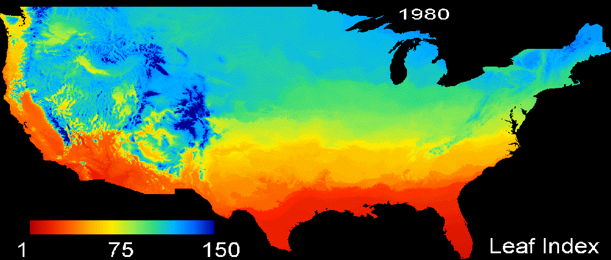

# Extended Spring Indices (SI-x) using Google Earth Engine.

This toolbox contains the scripts needed to calculate the First Leaf and First Bloom indices using Google Earth Engine (GEE) Python API.

# Overview

Changes in climate are evident in observacional weather and ecological records. Understanding the causes and impacts of climate change is fundamental to design mitigation and adaptation actions. Therefore, consistent climate change indicators such as phenological observations and indices are needed. Here we show how derive phenological indices using a phenoclimatological model, namely the Extended Spring Indices model (SI-x). This model, which was developed by [Schwartz in 2013](https://rmets.onlinelibrary.wiley.com/doi/full/10.1002/joc.3625), is based on thermal models (without chilling requirements) trained for two key indicator plan species Lilac (Syringa chinensis “Red Rothomagensis”) and Honeysuckle (Lonicera tatarica “Arnold Red” and Lonicera korolkowii “Zabeli”). The SI-x model is used to generate the [Start of Spring indicator](http://www.globalchange.gov/explore/indicators) that is part of the US Global Change Research Program. This indicator is important because it provides a direct connection between climate change and its impact on vegetation phenology (i.e. the timing of sprint onset). 

The SIx model was available on specific locations (based on plant monitoring or weather stations) or as coarse spatial resolution gridded produts. More recently, [Crimmins et al](https://pubs.er.usgs.gov/publication/ofr20171003) provided a product with a spatial resolution of 4 km. However, higher spatial resolution products provide more realistic views of local phenology and better support local and regional studies. Here, using cloud computing and high spatial resolution weather data, we provide long-term series of the First leaf and First Bloom indices at 1 km.

# Background

The SI-x model requires daily maximum and minimum temperature as well as the day length (i.e. the hours with sunlight). From these inputs, Growing Degree Hours (GDH) are calculated and used to define various accumulations of short- and long-term temperature-based variables. These variables are used to predict the **First Leaf** and **First Bloom** indices as the average of the results obtained for Lilac and the two varieties of Honeysuckle. For completenss, here below we provide the per plant equations obtained by [Schwartz in 2013](https://rmets.onlinelibrary.wiley.com/doi/full/10.1002/joc.3625):

* For the **First Leaf** index: 

$$DDE\cdot20.201+DD57\cdot0.153+SYNOP\cdot13.878+MDS0\cdot3.306>=1000 \text{ (Lilac)}$$

$$DD57\cdot0.248+SYNOP\cdot20.899+MDS0\cdot4.266>=1000  \text{ (Arnold Red Honeysuckle)}$$

$$DDE2\cdot0.266+SYNOP\cdot21.433+MDS0\cdot2.802>=1000 \text{ (Zabeli Honeysuckle)}$$

Where $DDE2$ is the accumulated GDH from day $t$ until day $t+2$, $DD57$ is the accumulated GDH from day $t+5$ until day $t+7$ with $t$ being a temporal index from January $1^{st}$, $ASYNOP$ is accumulative of the synop variable which is $1$ when $DDE2>637$ and otherwise is $0$ and $MDS0$ is a counter that starts on January $1^{st}$.

* For the **First Bloom** index:

$$ACGDH\cdot0.116-MDS0\cdot23.934>=1000$$

$$ACGDH\cdot0.127+MDS0\cdot24.825>=1000$$

$$ACGDH\cdot0.096+MDS0\cdot11.368>=1000$$

where $ACGDH$ is the accumulation of GDH from the date of the First Leaf index and, $MDS0$ is a(nother) counter that starts on the date of the First Leaf index.

# Toolbox description

This toolbox contains the following functions:

1. Leaf_Index.py    - Computes the Leaf images from 1st January to the day of the year (DOY) 300. The images have four bands: Lilac, Arnold Red, Zabeli and Leaf.
2. Bloom_Index.py   - Computes the Bloom images from 1st January to the day of the year (DOY) 300. The images have four bands: Lilac, Arnold Red, Zabeli and Bloom.
3. six_functions.py - Main file that contains the functions used to calculate spring indices.

## Study areas

At the present, the 1 km SI-x products are available over two study areas:
* North and Central America (located between 14°02'31.3"N and 55°37'04.1"N latitude and 56°05'50.7"W 126°22'06.1"W longitude). [Daymet version 4](https://daymet.ornl.gov/) from 1980 to 2021, was used to generate this dataset. The daily maximunim and minimum temperature and daylength are available in GEE. These SI-x products are an updated version of those presented in [Izquierdo-Verdiguier et al](https://www.sciencedirect.com/science/article/pii/S0168192318302193?via%3Dihub).
* Europe (located between 35°55'48.7"N and 73°32'47.1"N latitude and  10°36'29.5"W and 44°50'29.5"E longitude). The daily maximum and minimum temperature come from the [Downscaled version of European Observations (E-OBS)](https://rmets.onlinelibrary.wiley.com/doi/10.1002/joc.4436) version 3 from 1950 to 2020, which is available for download [here](/url{ftp://palantir.boku.ac.at/Public/ClimateData}). The daylength is calculated (modelled) once the data are ingested in GEE (ingested because this data is not directly available in GEE). 

First Leaf index over contiguous US    |  First Leaf index over Europe
:-------------------------:|:-------------------------:
  |   

# Instalation:

To install the libraries:

    pip install -r requirements.txt
    
# Contact

If you have problems with the toolbox, please contact to us. 

* Emma Izquierdo-Verdiguier: <emma.izquierdo@boku.ac.at>
* Raul Zurita-Milla: <r.zurita-milla@utwente.nl>
